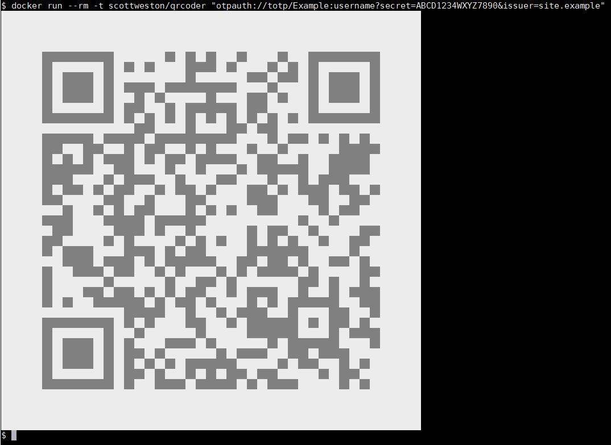

# QR code generator for the terminal

Easily get info from a terminal onto your phone/tablet, e.g.:

```
$ docker run --rm -t scottweston/qrcode-generator \
  "otpauth://totp/Example:username?secret=ABCD1234WXYZ7890&issuer=site.example"
```


